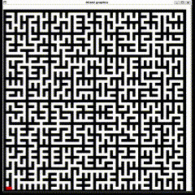

# Générateur et Solveur de Labyrinthe en OCaml

Ce projet implémente un générateur et un solveur de labyrinthe en OCaml, avec une visualisation graphique du processus.



## Caractéristiques

- Génère un labyrinthe aléatoire en utilisant un algorithme de division récursive
- Résout le labyrinthe en utilisant un algorithme de recherche en profondeur
- Visualise le processus de génération et de résolution du labyrinthe

## Configuration de la taille du labyrinthe

Le programme permet de générer des labyrinthes de différentes tailles en modifiant la variable `maze_size` dans le fichier `maze.ml`. 
Cette valeur détermine la taille du labyrinthe en utilisant une puissance de deux.

Par défaut, la valeur de `maze_size` est définie à `6`, ce qui génère un labyrinthe de `(2^6 + 1) x (2^6 + 1)` cellules, soit 65x65.

Pour changer la taille du labyrinthe, modifiez cette ligne dans le code :

\`\`\`ocaml
let maze_size = 6
\`\`\`

Par exemple, pour générer un plus petit labyrinthe de `(2^4 + 1) x (2^4 + 1)` cellules, soit 17x17 :

\`\`\`ocaml
let maze_size = 4
\`\`\`

## Prérequis

* OCaml (testé avec la version 4.08.1)
* Bibliothèque Graphics
  
## Installation

1. Clonez ce dépôt :
   ```
   git clone https://github.com/nursek/Maze-Visualiser.git
   cd Maze-Visualizer
   ```

2. Compilez le programme :
   ```
   ocamlc graphics.cma unix.cma maze.ml -o maze
   ```

## Utilisation

Exécutez le programme compilé :

```
./maze
```

* Le programme ouvrira une fenêtre affichant le labyrinthe généré.
* Le solveur commencera automatiquement à chercher un chemin du coin supérieur gauche au coin inférieur droit.